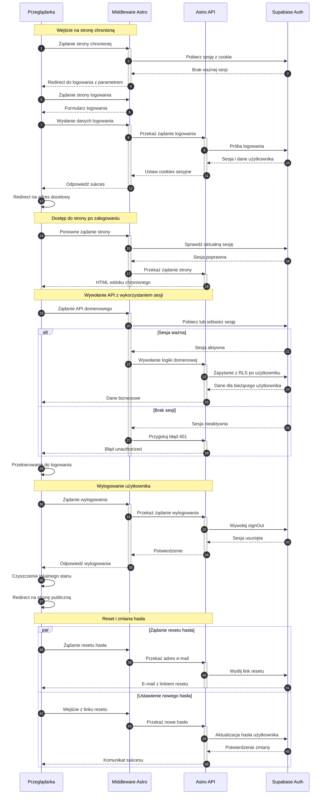

```mermaid
sequenceDiagram
  autonumber

  participant Browser as Przeglądarka
  participant Middleware as Middleware Astro
  participant API as Astro API
  participant Auth as Supabase Auth

  Note over Browser,Middleware: Wejście na stronę chronioną
  Browser->>Middleware: Żądanie strony chronionej
  activate Middleware
  Middleware->>Auth: Pobierz sesję z cookie
  Auth-->>Middleware: Brak ważnej sesji
  Middleware-->>Browser: Redirect do logowania z parametrem
  deactivate Middleware

  Browser->>Middleware: Żądanie strony logowania
  Middleware-->>Browser: Formularz logowania
  Browser->>Middleware: Wysłanie danych logowania
  activate Middleware
  Middleware->>API: Przekaż żądanie logowania
  activate API
  API->>Auth: Próba logowania
  Auth-->>API: Sesja i dane użytkownika
  API-->>Middleware: Ustaw cookies sesyjne
  deactivate API
  Middleware-->>Browser: Odpowiedź sukces
  deactivate Middleware
  Browser->>Browser: Redirect na adres docelowy

  Note over Browser,Middleware: Dostęp do strony po zalogowaniu
  Browser->>Middleware: Ponowne żądanie strony
  activate Middleware
  Middleware->>Auth: Sprawdź aktualną sesję
  Auth-->>Middleware: Sesja poprawna
  Middleware->>API: Przekaż żądanie strony
  activate API
  API-->>Browser: HTML widoku chronionego
  deactivate API
  deactivate Middleware

  Note over Browser,API: Wywołanie API z wykorzystaniem sesji
  Browser->>Middleware: Żądanie API domenowego
  activate Middleware
  Middleware->>Auth: Pobierz lub odśwież sesję
  alt Sesja ważna
    Auth-->>Middleware: Sesja aktywna
    Middleware->>API: Wywołanie logiki domenowej
    activate API
    API->>Auth: Zapytanie z RLS po użytkowniku
    Auth-->>API: Dane dla bieżącego użytkownika
    API-->>Browser: Dane biznesowe
    deactivate API
  else Brak sesji
    Auth-->>Middleware: Sesja nieaktywna
    Middleware->>API: Przygotuj błąd 401
    activate API
    API-->>Browser: Błąd unauthorized
    deactivate API
  end
  deactivate Middleware
  Browser->>Browser: Przekierowanie do logowania

  Note over Browser,API: Wylogowanie użytkownika
  Browser->>Middleware: Żądanie wylogowania
  activate Middleware
  Middleware->>API: Przekaż żądanie wylogowania
  activate API
  API->>Auth: Wywołaj signOut
  Auth-->>API: Sesja usunięta
  API-->>Middleware: Potwierdzenie
  deactivate API
  Middleware-->>Browser: Odpowiedź wylogowania
  deactivate Middleware
  Browser->>Browser: Czyszczenie lokalnego stanu
  Browser->>Browser: Redirect na stronę publiczną

  Note over Browser,API: Reset i zmiana hasła
  par Żądanie resetu hasła
    Browser->>Middleware: Żądanie resetu hasła
    Middleware->>API: Przekaż adres e-mail
    activate API
    API->>Auth: Wyślij link resetu
    Auth-->>Browser: E-mail z linkiem resetu
    deactivate API
  and Ustawienie nowego hasła
    Browser->>Middleware: Wejście z linku resetu
    Middleware->>API: Przekaż nowe hasło
    activate API
    API->>Auth: Aktualizacja hasła użytkownika
    Auth-->>API: Potwierdzenie zmiany
    API-->>Browser: Komunikat sukcesu
    deactivate API
  end
```
