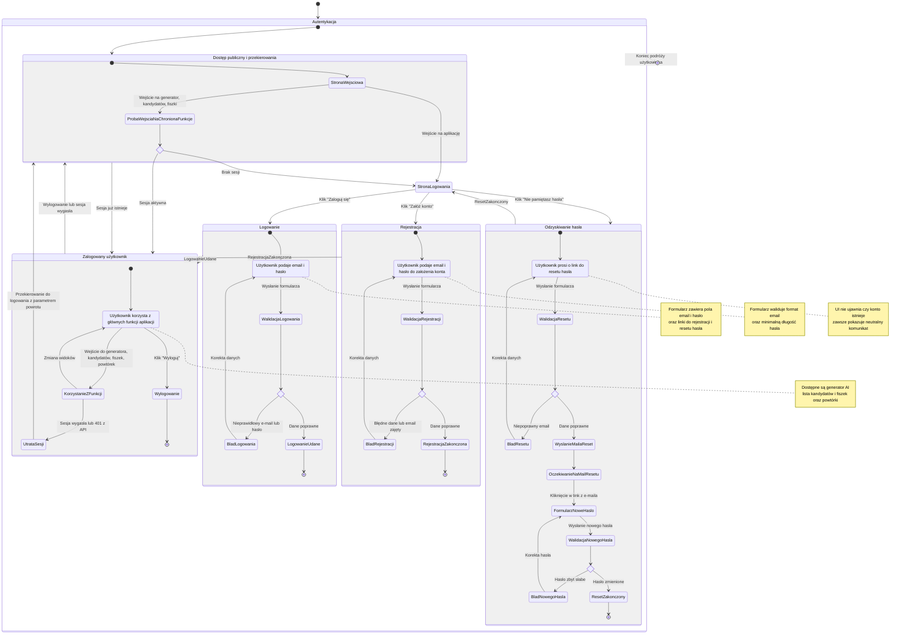

```mermaid
stateDiagram-v2

[*] --> Autentykacja

state "Autentykacja" as Autentykacja {

  [*] --> PublicznyDostep

  state "Dostęp publiczny i przekierowania" as PublicznyDostep {
    [*] --> StronaWejsciowa

    StronaWejsciowa --> StronaLogowania: Wejście na aplikację
    StronaWejsciowa --> ProbaWejsciaNaChronionaFunkcje: Wejście na generator, kandydatów, fiszki

    state if_public_redirect <<choice>>
    ProbaWejsciaNaChronionaFunkcje --> if_public_redirect

    if_public_redirect --> StronaLogowania: Brak sesji
    if_public_redirect --> ZalogowanyPanel: Sesja aktywna
  }

  StronaLogowania --> ProcesLogowania: Klik "Zaloguj się"
  StronaLogowania --> ProcesRejestracji: Klik "Załóż konto"
  StronaLogowania --> ProcesResetuHasla: Klik "Nie pamiętasz hasła"

  state "Logowanie" as ProcesLogowania {
    [*] --> FormularzLogowania

    FormularzLogowania --> WalidacjaLogowania: Wysłanie formularza

    state if_logowanie <<choice>>
    WalidacjaLogowania --> if_logowanie

    if_logowanie --> BladLogowania: Nieprawidłowy e-mail lub hasło
    if_logowanie --> LogowanieUdane: Dane poprawne

    BladLogowania --> FormularzLogowania: Korekta danych

    LogowanieUdane --> [*]

    FormularzLogowania: Użytkownik podaje email i hasło
    note right of FormularzLogowania
      Formularz zawiera pola email i hasło
      oraz linki do rejestracji i resetu hasła
    end note
  }

  state "Rejestracja" as ProcesRejestracji {
    [*] --> FormularzRejestracji

    FormularzRejestracji --> WalidacjaRejestracji: Wysłanie formularza

    state if_rejestracja <<choice>>
    WalidacjaRejestracji --> if_rejestracja

    if_rejestracja --> BladRejestracji: Błędne dane lub email zajęty

    if_rejestracja --> RejestracjaZakonczona: Dane poprawne

    BladRejestracji --> FormularzRejestracji: Korekta danych

    RejestracjaZakonczona --> [*]

    FormularzRejestracji: Użytkownik podaje email i hasło do założenia konta
    note right of FormularzRejestracji
      Formularz waliduje format email
      oraz minimalną długość hasła
    end note
  }

  state "Odzyskiwanie hasła" as ProcesResetuHasla {
    [*] --> FormularzResetuHasla

    FormularzResetuHasla --> WalidacjaResetu: Wysłanie formularza

    state if_reset <<choice>>
    WalidacjaResetu --> if_reset

    if_reset --> BladResetu: Niepoprawny email
    if_reset --> WyslanieMailaReset: Dane poprawne

    BladResetu --> FormularzResetuHasla: Korekta danych

    WyslanieMailaReset --> OczekiwanieNaMailResetu
    OczekiwanieNaMailResetu --> FormularzNoweHaslo: Kliknięcie w link z e-maila

    FormularzNoweHaslo --> WalidacjaNowegoHasla: Wysłanie nowego hasła

    state if_update <<choice>>
    WalidacjaNowegoHasla --> if_update

    if_update --> BladNowegoHasla: Hasło zbyt słabe
    if_update --> ResetZakonczony: Hasło zmienione

    BladNowegoHasla --> FormularzNoweHaslo: Korekta hasła

    ResetZakonczony --> [*]

    FormularzResetuHasla: Użytkownik prosi o link do resetu hasła
    note right of FormularzResetuHasla
      UI nie ujawnia czy konto istnieje
      zawsze pokazuje neutralny komunikat
    end note
  }

  state "Zalogowany użytkownik" as ZalogowanyPanel {
    [*] --> PanelUzytkownika

    PanelUzytkownika --> KorzystanieZFunkcji: Wejście do generatora, kandydatów, fiszek, powtórek
    KorzystanieZFunkcji --> PanelUzytkownika: Zmiana widoków

    PanelUzytkownika --> Wylogowanie: Klik "Wyloguj"
    KorzystanieZFunkcji --> UtrataSesji: Sesja wygasła lub 401 z API

    Wylogowanie --> [*]
    UtrataSesji --> PublicznyDostep: Przekierowanie do logowania z parametrem powrotu

    PanelUzytkownika: Użytkownik korzysta z głównych funkcji aplikacji
    note right of PanelUzytkownika
      Dostępne są generator AI
      lista kandydatów i fiszek oraz powtórki
    end note
  }

  PublicznyDostep --> ZalogowanyPanel: Sesja już istnieje
  ProcesLogowania --> ZalogowanyPanel: LogowanieUdane
  ProcesRejestracji --> ZalogowanyPanel: RejestracjaZakonczona
  ProcesResetuHasla --> StronaLogowania: ResetZakonczony
  ZalogowanyPanel --> PublicznyDostep: Wylogowanie lub sesja wygasła
}

Autentykacja --> [*]: Koniec podróży użytkownika
```
