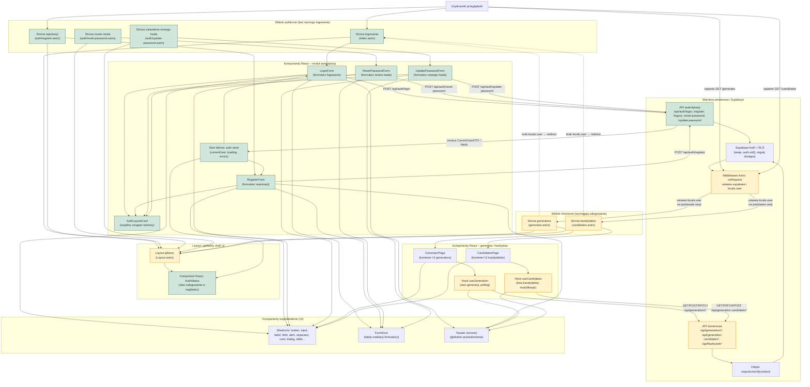

```mermaid
flowchart TD

  %% Główny aktor
  User["Użytkownik przeglądarki"]

  %% Warstwa middleware i Supabase
  subgraph BackendInfra["Warstwa serwerowa i Supabase"]
    MiddlewareNode["Middleware Astro: onRequest<br/>ustawia supabase i locals.user"]
    AuthApi["API autentykacji<br/>/api/auth/login, /register, /logout, /reset-password, /update-password"]
    DomainApi["API domenowe<br/>/api/generations*, /api/generation-candidates*, /api/flashcards*"]
    RequireUser["Helper requireUserId(context)"]
    SupabaseAuth["Supabase Auth + RLS<br/>(sesje, auth.uid(), reguły dostępu)"]
  end

  %% Layout i globalny shell
  subgraph LayoutShell["Layout i globalny shell UI"]
    LayoutNode["Layout główny<br/>(Layout.astro)"]
    AuthStatus["Komponent React: AuthStatus<br/>(stan zalogowania w nagłówku)"]
  end

  LayoutNode --> AuthStatus

  %% Publiczne strony auth
  subgraph PublicViews["Widoki publiczne (bez wymogu logowania)"]
    IndexPage["Strona logowania<br/>(index.astro)"]
    RegisterPage["Strona rejestracji<br/>(auth/register.astro)"]
    ResetPwdPage["Strona resetu hasła<br/>(auth/reset-password.astro)"]
    UpdatePwdPage["Strona ustawienia nowego hasła<br/>(auth/update-password.astro)"]
  end

  IndexPage --> LayoutNode
  RegisterPage --> LayoutNode
  ResetPwdPage --> LayoutNode
  UpdatePwdPage --> LayoutNode

  %% Komponenty React dla auth
  subgraph AuthReact["Komponenty React – moduł autentykacji"]
    AuthLayoutCard["AuthLayoutCard<br/>(wspólny wrapper kartowy)"]
    LoginForm["LoginForm<br/>(formularz logowania)"]
    RegisterForm["RegisterForm<br/>(formularz rejestracji)"]
    ResetPasswordForm["ResetPasswordForm<br/>(formularz resetu hasła)"]
    UpdatePasswordForm["UpdatePasswordForm<br/>(formularz nowego hasła)"]
    AuthStore["Stan klienta: auth store<br/>(currentUser, loading, errors)"]
  end

  IndexPage --> LoginForm
  RegisterPage --> RegisterForm
  ResetPwdPage --> ResetPasswordForm
  UpdatePwdPage --> UpdatePasswordForm

  LoginForm --> AuthLayoutCard
  RegisterForm --> AuthLayoutCard
  ResetPasswordForm --> AuthLayoutCard
  UpdatePasswordForm --> AuthLayoutCard

  LoginForm -- "POST /api/auth/login" --> AuthApi
  RegisterForm -- "POST /api/auth/register" --> AuthApi
  ResetPasswordForm -- "POST /api/auth/reset-password" --> AuthApi
  UpdatePasswordForm -- "POST /api/auth/update-password" --> AuthApi

  AuthApi --> SupabaseAuth
  SupabaseAuth --> MiddlewareNode

  AuthApi -- "zwraca CurrentUserDTO / błędy" --> AuthStore
  AuthStore --> AuthStatus
  AuthStore --> LoginForm
  AuthStore --> RegisterForm

  User --> IndexPage
  User --> RegisterPage

  %% Strony chronione i komponenty domenowe
  subgraph ProtectedViews["Widoki chronione (wymagają zalogowania)"]
    GeneratorPageAstro["Strona generatora<br/>(generator.astro)"]
    CandidatesPageAstro["Strona kandydatów<br/>(candidates.astro)"]
  end

  subgraph DomainReact["Komponenty React – generator i kandydaci"]
    GeneratorPageReact["GeneratorPage<br/>(kontener UI generatora)"]
    CandidatesPageReact["CandidatesPage<br/>(kontener UI kandydatów)"]
    UseGenerationHook["Hook useGeneration<br/>(stan generacji, polling)"]
    UseCandidatesHook["Hook useCandidates<br/>(lista kandydatów, modyfikacje)"]
  end

  GeneratorPageAstro --> LayoutNode
  CandidatesPageAstro --> LayoutNode

  GeneratorPageAstro --> GeneratorPageReact
  CandidatesPageAstro --> CandidatesPageReact

  GeneratorPageReact --> UseGenerationHook
  CandidatesPageReact --> UseCandidatesHook

  UseGenerationHook -- "GET/POST/PATCH<br/>/api/generations*" --> DomainApi
  UseCandidatesHook -- "GET/PATCH/POST<br/>/api/generation-candidates*" --> DomainApi

  DomainApi --> RequireUser
  RequireUser --> SupabaseAuth

  User -- "żądanie GET /generator" --> MiddlewareNode
  User -- "żądanie GET /candidates" --> MiddlewareNode
  MiddlewareNode -- "ustawia locals.user<br/>na podstawie sesji" --> GeneratorPageAstro
  MiddlewareNode -- "ustawia locals.user<br/>na podstawie sesji" --> CandidatesPageAstro

  GeneratorPageAstro -. "brak locals.user → redirect" .-> IndexPage
  CandidatesPageAstro -. "brak locals.user → redirect" .-> IndexPage

  %% Komponenty UI współdzielone
  subgraph SharedUI["Komponenty współdzielone (UI)"]
    UiAtoms["Shadcn/ui: button, input,<br/>label, field, alert, separator, card, dialog, table..."]
    FormErrorNode["FormError<br/>(błędy walidacji formularzy)"]
    ToasterNode["Toaster (sonner)<br/>(globalne powiadomienia)"]
  end

  LoginForm --> UiAtoms
  RegisterForm --> UiAtoms
  ResetPasswordForm --> UiAtoms
  UpdatePasswordForm --> UiAtoms
  GeneratorPageReact --> UiAtoms
  CandidatesPageReact --> UiAtoms

  LoginForm --> FormErrorNode
  RegisterForm --> FormErrorNode
  ResetPasswordForm --> FormErrorNode
  UpdatePasswordForm --> FormErrorNode

  LoginForm --> ToasterNode
  RegisterForm --> ToasterNode
  UseGenerationHook --> ToasterNode
  UseCandidatesHook --> ToasterNode

  %% Wyróżnienie komponentów aktualizowanych przez wymagania auth
  classDef updated fill:#fff3cd,stroke:#f0ad4e,stroke-width:2px;
  classDef new fill:#d1e7dd,stroke:#0f5132,stroke-width:1px;

  class LayoutNode,GeneratorPageAstro,CandidatesPageAstro,UseGenerationHook,UseCandidatesHook,MiddlewareNode,DomainApi updated;
  class IndexPage,RegisterPage,ResetPwdPage,UpdatePwdPage,LoginForm,RegisterForm,ResetPasswordForm,UpdatePasswordForm,AuthStatus,AuthLayoutCard,AuthApi,AuthStore new;
```
